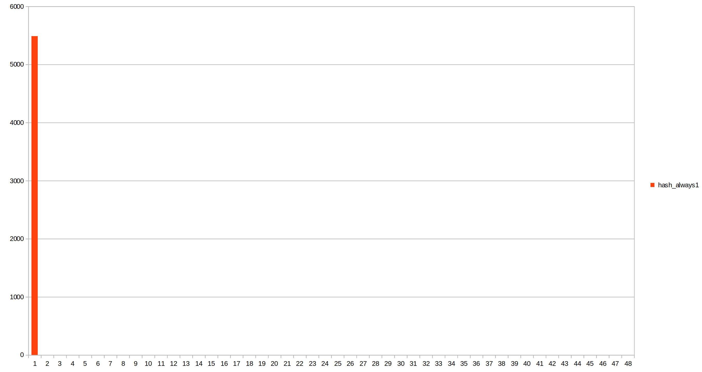
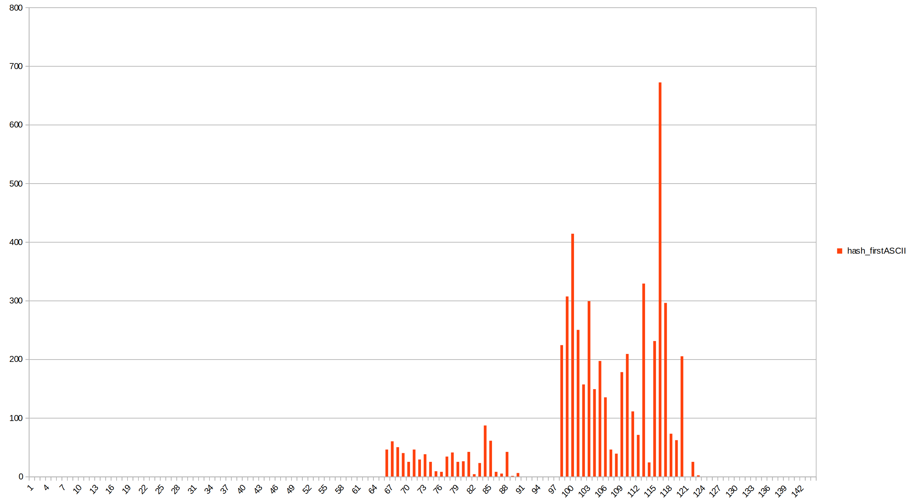
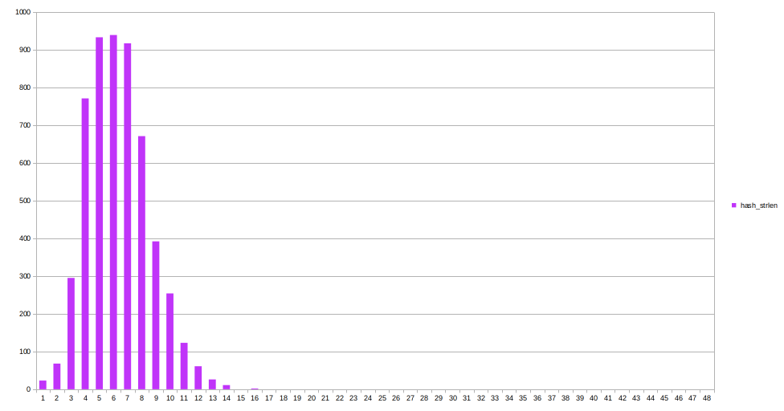
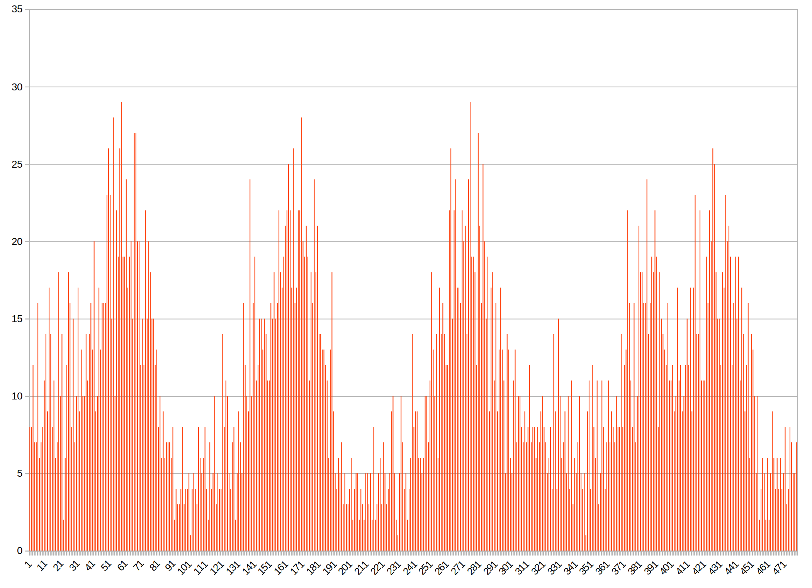
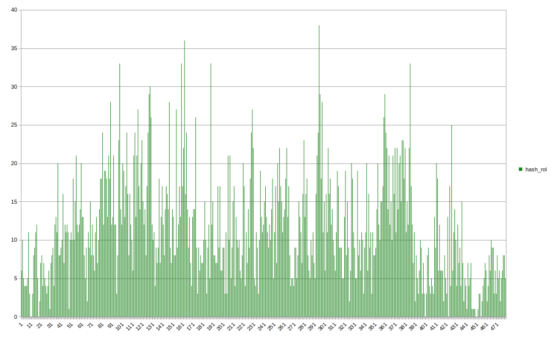
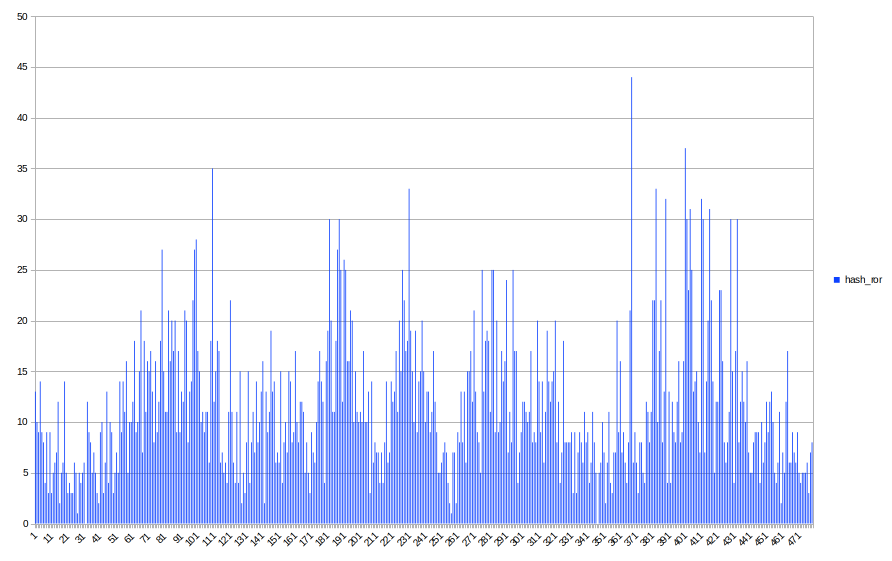
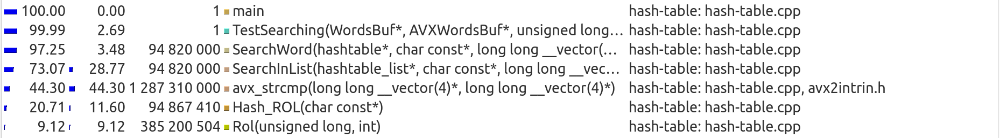

# "Hash Table"
## Project description
The project's main aim is to test different hash functions and to optimize the process of searching words in a hash table. Let's make a research, how changing hash function and different optimizations influence on running time and other characteristics of our program.

This project is a part of MIPT course "Basics of industrial programming" by [I.R. Dedinsky](https://github.com/ded32).
## Some theory
A hash table is a data structure that implements an associative array or dictionary. It is an abstract data type that maps keys to values. A hash table uses a hash function to compute an index, also called a hash code, into an array of buckets or slots, from which the desired value can be found. 

The picture below can help you to study how a hash table should be arranged:


For more information about hash tables follow https://en.wikipedia.org/wiki/Hash_table.

## Work plan
Let's create a hash table that contains single linked lists. As you can see, C++ has been chosen as the main language for realization of our plans.
Our program should have an oportunity to use different hash functions, so it's advisable to get such function as an argument.
Then we should fill the table with a great amount of words. I've chosen "Fahrenheit 451" by Ray Bradbury as a text to get words from.

##### Part 1. Testing hash functions
Let's create diagrams that show list sizes for each hash value. Ideal hash function should have a flat diagram, so we are going to compare the results and make a kind of rating of hash functions.

##### Part 2
This part of the project involves creating different manual optimizations. Here is the list of optimizations we are going to use:
1. Assembly insertions. We are going to inline some functions using GNU Assembler. Here is a [guide](http://asmcourse.cs.msu.ru/wp-content/uploads/2013/04/gcc-inline-asm.pdf) for assembly insertions in C++.
2. Calling assembly functions from C++. Documentation for NASM can be found [here](https://www.opennet.ru/docs/RUS/nasm/).
3. AVX (Advanced Vector Extensions, extension of Intel & AMD command system). To learn more about AVX follow [Intel Intrinsics Mirror](https://www.laruence.com/sse/).
4. Choosing a better hash function that has a hardware support and is faster than others.

A block of code to optimize will be chosen using tools from valgrind package. More details can be found [here] __hyperlink__
As a result, let's compare running time of our program before and after inserting optimizations.

## 

## Part 1. Testing hash functions

#### Program features

Let's collect some statistics. It's advisable to create a function for saving all list sizes to csv files with appropriate names. Then, using LibreOffice or MS Excel, we should create diagrams with info from this file.

Some words about size of the hash table. In real conditions hash tables have 1-2 elements in each list to get a better performance. These conditions cause a huge size of the hash table. But in case of testing hash functions 1-2 elements in each list will spoil our diagrams and make them uninformative. That's why we should intensionally decrease hash table's size to make diagrams better.

Also, theory of hashing says, that size of a hash table should be a prime number to get a better distribution. It's obvious that this size depends on amount of words in the text. Let's choose a divisor for number of words in the text:
$$hashtable \text{ } size = \frac{number \text{ } of \text{ } words \text{ } in \text{ } the \text{ }text}{divisor}$$
These conditions should be satisfied:
1. Size of the hash table should be a prime number;
2. For a rather good hash function there should be 5-20 words in each list.
   
I experimentally obtained, that this divisor should have a value _99_ for the chosen text.

So, let's start describing and analyzing each hash function.

#### Hash function #1. "Always 1" [Always the first]
It's a basic hash function that always returns _1_ regardless of the word. 

<details>
<summary><b>"Always 1" hash implementation</b></summary>

~~~C++
size_t Hash_Always1(const char* word)
{
    return 1;
}
~~~
</details>

Diagram:


As you can see, all the words have been stored to a list with index _[1]_. This function has a diagram that is as far as possible from a flat one.
Actually, __"Always 1"__ is a simple test for the algorythm of hashing, but not a function for real use.

#### Hash function #2. "First ASCII"
This hash function returns ASCII code of the first letter of a word. 

<details>
<summary><b>"First ASCII" hash implementation</b></summary>

~~~C++
size_t Hash_FirstASCII(const char* word)
{
    return word[0];
}
~~~
</details>


Diagram:


The diagram has 2 very high columns (414 words for hash value _99_ and 672 words for hash value _115_) and a small range of hash values (from 67 to 122).
Hash tables based on __"First ASCII"__ function are usable, but extremely inefficent.

#### Hash function #3. "Strlen"
This hash function returns length of a word as a hash value. Here is its implementation:

<details>
<summary><b>"Strlen" hash implementation</b></summary>

~~~C++
size_t Hash_Strlen(const char* word)
{
    return strlen(word);
}
~~~
</details>


Diagram:


The diagram actually reminds some kind of a _normal_ _distribution_. All the words have a hash value not bigger than 16. This range (from 0 to 16) is increadibly small for a good hash function. Though the diagram is far from a flat one, __"Strlen"__ is already a possible variant for creating a working hash table.

#### Hash function #4. "Sum ASCII codes"
This hash function returns sum of ASCII codes of all symbols in a word. Here is its implementation:
<details>
<summary><b>"Sum ASCII codes" hash implementation</b></summary>

~~~C++
size_t Hash_SumASCII(const char* word)
{
    size_t sum = 0;
    int i = 0;
    while (word[i] != '\0')
    {
        sum += word[i];
        i++;
    }
    return sum;
}
~~~
</details>

Diagram:
 

The first advantage of this function, that we see in the diagram - it uses all hash value range (unlike other 3 hash functions that we have already tested). I must admit, that it's because of our intensional decreasing of hash value range. In real conditions this hash function will hardly use full hash value range. Sum of ASCII codes is limited by multiplication of max ASCII code of a letter to max number of letters in a word. Hash value range can be much bigger than the result of this multiplication.
However, the diagram has 4 pronounced peaks, and some lists have up to 29 elements. __"Sum ASCII codes"__ function looks rather attractive in comparison with __"Always 1"__, __"First ASCII"__ and __"Strlen"__, but it still has a lot of disadvantages.

#### Hash function #5. "ROL"
This hash function counts the hash value using this formula:
$$H_{i+1} = rol(H_i) \wedge word[i]$$
As a start hash value we take $H_0 = 0$.
$rol$ is an assembly function that implements bit rotation to the left.
It works like this:

<details>
<summary><b>"ROL" hash implementation</b></summary>

~~~C++
size_t Hash_ROL(const char* word)
{
    size_t value = 0;
    int i = 0;
    while (word[i] != '\0')
    {
        value = (Rol(value, 1)) ^ word[i];
        i++;
    }
    return value;
}

size_t Rol(size_t value, int shift)
{
    return (value << shift) | (value >> (sizeof (int) - shift));
}
~~~
</details>

Diagram:


This function uses all hash value range too. Though the diagram has very high columns, most of them are outstanding. Generally, the values are closer to the average one, than in functions described before.

#### Hash function #6. "ROR"
This hash function is similar to the previous one, but $rol$ changes to $ror$:
$$H_{i+1} = ror(H_i) \wedge word[i]$$
As a start hash value we take $H_0 = 0$.
$ror$ is an assembly function that implements bit rotation to the right.
It works like this:
<details>
<summary><b>"ROR" hash implementation</b></summary>

~~~C++
size_t Hash_ROR(const char* word)
{
    size_t value = 0;
    int i = 0;
    while (word[i] != '\0')
    {
        value = ((value >> 1) | (value << (sizeof (int) - 1))) ^ word[i];
        i++;
    }
    return value;
}
~~~
</details>

Diagram:


This function uses all hash value range too. Though the diagram has very high columns, most of them are outstanding. Generally, the values are closer to the average one, than in functions described before.

#### Hash function #7. "RS"
I've chosen this hash function, because it has rather good characteristics and a very simple implementation. 
<details>
<summary><b>"RS" hash implementation</b></summary>

~~~C++
size_t Hash_Rs(const char* word)
{

    static const unsigned int b = 378551;
    unsigned int a = 63689;
    size_t value = 0;

    int i = 0;
    while (word[i] != '\0')
    {
        value = value * a + (unsigned char) word[i];
        a *= b;
        i++;
    }

    return value;
}
~~~
</details>

Diagram:


This function uses all hash value range too. Though the diagram has very high columns, most of them are outstanding. Generally, the values are closer to the average one, than in functions described before.

## Auto build
In order to run the program you should use Makefile. After cloning this repository to your computer type "make" in the terminal _in repo's directory_. In the Makefile's variable __CFLAGS__ you can turn on and off logging using _-DLOGGING_ flag. With the help of variable __OPTFLAG__ you can choose compiler optimization (-O0, -O1, -O2, -O3 or -Ofast) and manual optimization (see _Part 2_ __hyperlink__) using _-DOPT_CMP_, _-DOPT_RS_ and _-DOPT_ROL_ flags.

## Manual build
Compilation in terminal:

```g++ -c -no-pie -mavx2 -msse2 -fno-omit-frame-pointer -DLOGGING -O2 hash-table.cpp```
```g++ -c -no-pie -mavx2 -msse2 -fno-omit-frame-pointer -DLOGGING -O2 includes/logging/logging.cpp```

Compilation of nasm function __Hash ROL__ (if neccessary):

```nasm -f elf64 -l rol_asm.lst hash_rol.asm```

Linking:

```g++ hash-table.o logging.o hash_rol.o -o hash-table```

In case of using C++ implementation of __Hash ROL__ (instead of assembly one) delete _hash_rol.o_ from this line.

Finally, execute the program:

```./hash-table```

## Part 2. Optimizations

### Description

#### Tools for analysis
There is a great amount of various tools and applications that can analyze your program at runtime. I've chosen callgrind profiler (an utility that is provided in a valgrind package) for my research. It emulates each executable program instruction. Callgrind uses internal metrics about the «cost» of each instruction to give us the conclusion we need.
To install valgrind (that contains callgrind), type:

```sudo apt install valgrind```

We also need a tool that will help us to read and analyze callgrind's reports. Kcachegrind is maybe one of the most useful programs for this case.
For more information about valgrind see its [official site](https://valgrind.org/), [quick start guide](https://valgrind.org/docs/manual/quick-start.html) and [user manual](https://valgrind.org/docs/manual/manual.html).

#### Word search implemetation
Probably the most important function in a hash table is a function that searches words. In my program it's rather simply implemented:

<details>
<summary><b>SearchWord implementation</b></summary>

~~~C++
int SearchWord(htab_t* hashtable, const char* word)
{
    size_t index = hashtable->HashFunc(word) % hashtable->size;

    int res = SearchInList(&(hashtable->table[index]), word);
    return res;
}
~~~
</details>

A few words about searching in a list. In real hash tables lists don't usually contain more than 1-2 words, so such search doesn't take much time. That's why the most common idea is to organize a linear search. It can be done by "sign by sign comparison" of each word from the list with the search word. 

But in our test case there can be more than 40 words in a list. It really depends on the hash function that we are going to use. So linear search can be rather slow in our conditions and maybe we should optimize it.

Here is the implementation of searching a word in a list:

<details>
<summary><b>SearchList implementation</b></summary>

~~~C++
int SearchInList(list_t* list, const char* word)
{
    node_t* node = list->head;

    for (size_t list_i = 0; list_i < list->size; list_i++)
    {
        if (!strcmp(node->elem, word))
        {
            // Word found!
            return list_i;
        }
        node = node->next;
    }

    // Word not found    
    return -1;
}
~~~
</details>

#### Choice of hash function

According to the diagrams and statistics from part 1, we can see that the best 3 hash functions are: Hash RS, Hash ROL and Hash ROR. 
Hash RS is rather slow and hard to optimize. 
Hash ROL has rather good diagram and there are plenty of ways to make it faster. That's why I've chosen __Hash ROL__ for my future tests.

Now it's time to refine the program.

### Version 0. No optimizations (_baseline_)
#### Make search great again
Filling hash table with the words from the text is rather slow, but it's usually done only once, right after creating a hash table. It's far more important to optimize the function that searches words, because it might be called many times.
So, let's call it for nearly 2000 times (for all words in the text in each time) to increase the influence of search functions on the program's performance.

There are 47410 words in "Fahrenheit 451" (text that is loaded into the hash table), so we are going to call __SearchWord__ function nearly $n = 47410 \cdot 2000 = 94 \text{ } 820 \text{ } 000$ times.


#### General analysis of profiling data

Let's have a look at a callgrind report.


It's easy to see, that except __main__ and __TestSearching__ (general controling functions that can't be optimized) the most "heavy" functions are: __SearchWord__, __SearchInList__, __strcmp__ and __Hash ROL__. 
__SearchWord__ controls the whole search and doesn't really "eat" computer resources itself. It is shown in the second column, where we can see the time, which was spent in each function, excluding its children. 3.94 (SearchWord) is relatively small in comparison with 38.64 (strcmp). 
__SearchInList__ consists of almost one for-cycle and is too simple to be optimized.

Next function in callgrind's list is __strcmp__. It seems to be not efficent enough. Let's try to make it faster.

### Version 1. AVX-paralleling of strcmp
##### Idea
Compiler usually uses __strcmp_avx2__ for standard function strcmp from \<string.h\>. The main idea is to align all words (make their addresses divisible by 32 bytes). It will give us a chance to use ordered AVX2 instructions that are faster than unordered ones.

##### Implementation

To align all words we should create an alligned buffer, which size is $num\_words \cdot 32$ bytes. Here is the function of filling such buffer:

<details>
<summary><b>Filling aligned buffer function</b></summary>

~~~C++
void FillAVXWordsBuf(avx_wordsbuf_t* avx_wordsbuf, wordsbuf_t* words_buf)
{
    __m256i* temp_ptr = (__m256i*) aligned_alloc(32, words_buf->size * sizeof(__m256i));
    Assert(temp_ptr == nullptr);


    avx_wordsbuf->buf = temp_ptr;
    __m256i* avx_wb_pointer = avx_wordsbuf->buf;                                                 // points the first free elem of buffer

    for (size_t i = 0; i < words_buf->size; i++)
    {
        strcpy((char*) avx_wb_pointer, words_buf->buf[i]);        
        avx_wb_pointer++;
    }

    log("finish filling avx buf\n");

    avx_wordsbuf->buf      = temp_ptr;
    avx_wordsbuf->size     = words_buf->size;
    avx_wordsbuf->capacity = words_buf->capacity;

}
~~~
  
</details>


<br>
In structure of each list node we have to add a pointer to the word in aligned buffer:

<details>
<summary><b>New structure of node</b></summary>

~~~C++
typedef struct node
{
    const char*  elem;
    struct node* next;
    __m256i* avx_elem;

} node_t;
~~~
</details>

<br>
Now it's time to write a comparing function:

<details>
<summary><b>My implementation of avx2 strcmp</b></summary>

~~~C++
int avx_strcmp(__m256i* word1, __m256i* word2)
{
    __m256i cmp_mask = _mm256_cmpeq_epi8(*word1, *word2);

    if (_mm256_movemask_epi8(cmp_mask) == -1)    
    {
        return 0;
    }

    return -1;
}
~~~
  
</details>

##### Performance
You can see the effect of this optimization:

| Optimization | Elapsed time (ms per measure)  | Absolute speed up (from baseline) |
| :----------: | :---------------: | :------------------: |
| Baseline [v.0] |      7.13        |     1                |
| AVX strcmp [v.1]|      6.05          |   1.17               |

_One measure_ means searching all words from the text. Each word is searched 1 time. There are usually nearly 2000 _measures_.

Obviously, this optimization has a good influence on program's performance.

New callgrind report:


The next functions to optimize in callgrind's list are __Hash ROL__ and __Rol__. Let's try to refine them.

### Version 2. Assembly insertion of ROL
##### Idea
In C++ there is no special function for rotating numbers, so ROL is implemented using 2 bit shifts:

<details>
<summary><b>Rol C++ implementation</b></summary>

~~~C++
size_t Rol(size_t value, int shift)
{
    return (value << shift) | (value >> (sizeof (int) - shift));
}
~~~
</details>

Luckily, __rol__ function is implemented in assembly and has a hardware support. Let's make an assembly insertion.

##### Implementation

Assembly insertions in C++ are written on GNU Assembler. MSU has prepared a very useful [guide](http://asmcourse.cs.msu.ru/wp-content/uploads/2013/04/gcc-inline-asm.pdf) about writing assembly insertions.
<details>
<summary><b>My Rol assembly insertion</b></summary>

~~~C++
asm (
        ".intel_syntax noprefix\n\t"
        "mov rax, %1\n\t"
        "rol rax, 1\n\t"
        "mov %0, rax\n\t"
        ".att_syntax prefix\n\t" 
        : "=r" (rol_value)
        : "r" (value)
        : "%rax"
    );
~~~
  
</details>

##### Performance

You can see the effect of this optimization:

| Optimization | Elapsed time (mcs per measure)  | Absolute speed up |
| :----------: | :---------------: | :------------------: |
| Baseline [v.0] |      7.13        |     1                |
| asm ins. rol [v.1]|      6.38         |   1.12               |

_One measure_ means searching all words from the text. Each word is searched 1 time. There are usually nearly 2000 _measures_.

New callgrind report looks like that:


As we can see, inlining of __rol__ made our hash function faster. In baseline self time in 2nd column ($13.14_\text{Hash ROL} + 10.33_\text{Rol} = 23.47$) was bigger than with asm insertion ($17.43$).
Therefore, we can conclude that this optimization made our program faster. However, __Hash ROL__ has even more oportunities to be optimized.

### Version 3. Assembly optimization of Hash ROL
##### Idea
Let's go further and rewrite whole __Hash ROL__ function in assembly and call it from C++.

##### Implementation

The function is written on __NASM 64__.
<details>
<summary><b>Hash ROL assembly implementation</b></summary>

~~~nasm
section .text
global asm_HashROL

asm_HashROL:
    push rcx 
    push rdx

    xor     eax, eax                ; start hash value = 0
    xor     ecx, ecx                ; symbol counter
.loop:
    mov     dl, byte [rdi + rcx]    ; dl = current symbol

    cmp     dl, 0                   ; reached end of line?
    je      .finish_hashing         ; if reached, finish hashing
    
    rol     eax, 1                  ; rotate left (shift = 1), 11001101 -> 10011011
    xor     al, dl                  ; xor last hash byte with current symbol

    inc     ecx                     ; increase counter
    jmp     .loop                   ; continue

.finish_hashing:
    pop rdx 
    pop rcx
    ret
~~~
  
</details>

##### Performance
You can see the effect of this optimization:

| Optimization | Elapsed time (ms per measure)  | Absolute speed up (from baseline) |  Relative speed up (from prev. version) |
| :----------: | :---------------: | :------------------: |  :------------------: |
| Baseline [v.0] |      7.13        |     1                |     1                |
| asm ins. rol [v.1] |      6.38        |     1.09                |     1.09                |
| asm rolhash [v.2]|      5.88          |   1.17               |     1.07                |

_One measure_ means searching all words from the text for 1 time. Each word is searched 1 time. There are usually nearly 2000 _measures_.

New callgrind report:


As we can see, rewriting the whole hash function in assembly appeared to be even faster than asm insertion. So, it's better to use optimization from [v.3] than from [v.2] (they are incompatible).

### Version 4. Changing hash function to faster one
##### Idea

Instead of optimizing __Hash ROL__, we can change it to __CRC32__. It's a hardware supported hash function, so it may make hashing faster.

##### Implementation

Let's write this function on __NASM 64__ and call from C++.
<details>
<summary><b>CRC32 assembly implementation</b></summary>

~~~nasm
section .text

global asm_crc32

asm_crc32:
    xor     rax, rax
    crc32   rax, qword [rdi]
    crc32   rax, qword [rdi+8]
    crc32   rax, qword [rdi+16]
    crc32   rax, qword [rdi+24]
    ret
~~~
  
</details>

##### Performance
You can see the effect of this optimization:

| Optimization | Elapsed time (ms per measure)  | Absolute speed up (from baseline) |  Relative speed up (from prev. version) |
| :----------: | :---------------: | :------------------: |  :------------------: |
| Baseline [v.0] |      7.13        |     1                |     1                |
| asm ins. rol [v.1] |      6.38        |     1.09                |     1.09                |
| asm crc32 [v.4]|      6.09          |   1.17               |     1.07                |

_One measure_ means searching all words from the text for 1 time. Each word is searched 1 time. There are usually nearly 2000 _measures_.

New callgrind report:


As we can see, rewriting the whole hash function in assembly appeared to be even faster than asm insertion. So, it's better to use optimization from [v.3] than from [v.2] (they are incompatible).


## Как достичь максимальной скорости вычислений? 

Проведем измерения FPS (количество кадров в секунду, что соответствует количеству рассчетов целого множества в секунду). Для повышения точности измерений будем усреднять значение FPS за первые 200 рассчетов множества. После 200-ой итерации в консоль выводится надпись "end of measuring". Значит, можно закрывать окно и считывать усредненное значение FPS, которое так же будет выведено в консоль сразу после закрытия окна.
Число 200 выбрано экспериментально по соотношению "время тестирования-точность результата". При желании в коде можно изменять число измерений (константа NUM_MEASURES).
В процессе измерений важно не двигать мышкой, не нажимать кнопки клавиатуры и не нагружать процессор другими способами. Эти сторонние факторы могут исказить результаты измерений.
Для упрощения измерений запустим функции с рассчета с AVX и без AVX последовательно друг за другом, вычисляя FPS отдельно для каждой функции.

### С отрисовкой


| Флаг оптимизации |       AVX2, fps        |    Без AVX2, fps    | Ускорение, раз |
| :------:         | :---------------: | :------------: | :------------: |
|    none          |       13.3        |       4.4      |       3.0      |
|    -O3           |       35.4        |       8.4      |       4.2      |
|   -Ofast         |       37.2        |       8.6      |       4.3      |

В графе "Ускорение" указано, во сколько раз использование AVX ускорило расчет по сравнению с одиночными вычислениями $\textit{при неизменном флаге компиляторной оптимизации}$.

Как мы видим, ускорение вычислений оставляет желать лучшего. Значительную часть времени работы программы составляет время, которое библиотека SFML тратит на отрисовку множества. Программно уберем отрисовку (сделаем пустое окно) и посмотрим, какого ускорения мы сможем достичь в этом случае. 

### Без отрисовки
Проведем замеры FPS для разных оптимизаций при отключенной отрисовке. 
| Флаг оптимизации |       AVX2, fps        |    Без AVX2, fps    | Ускорение, раз |
| :------:         | :---------------: | :------------: | :------------: |
|       none       |       15.6        |       4.6      |       3.4      |
|       -O1        |       57.9        |       8.9      |       6.5      |
|       -O2        |       60.0        |       9.0      |       6.7      |
|       -O3        |       58.6        |       9.1      |       6.4      |
|       -Ofast     |       64.2        |       9.4      |       6.8      |

В графе "Ускорение" указано, во сколько раз использование AVX ускорило расчет по сравнению с одиночными вычислениями $\textit{при неизменном флаге компиляторной оптимизации}$.

Отключение отрисовки существенно сказалось на времени работы программы. При малых FPS влияние отрисовки мало: 4.4 fps превратилось в 4.6 fps, ускорение в 1.05 раза. При высоких скоростях вычислений отрисовка занимает около 42% времени, что позволяет увеличить fps с 37.2 до 64.2 при её отключении.

## Сравнение результатов и выводы
Итого, мы получили, что использование AVX2 позволяет сократить время работы программы в 3-7 раз (в зависимости от типа компиляторной оптимизации). Таким образом, AVX2 в некоторых случаях может "обогнать" по времени компиляторные оптимизации, примененные к стандартному алгоритму. Одним из примеров объемных вычислений, для которых AVX-команды наиболее эффективны, и является множество Мандельброта, которое было исследовано в данном проекте.

Также необходимо отметить, что результаты измерений fps сильно зависят от многих факторов: от типа и модели процессора, от его загруженности и даже температуры. Результаты, представленные в работе, соответствуют запуску программы на процессоре Intel Core i5 при использовании Linux Mint 21. Все результаты получены при соблюдении практически одинаковых внешних условий. Однако, например, при других условиях запуска при максимальном использовании оптимизаций удается получить до 82 fps. Результаты измерений могут количественно отличаться в зависимости от условий запуска программы, но все качественные зависимости и тенденции, отмеченные в работе, сохранятся.