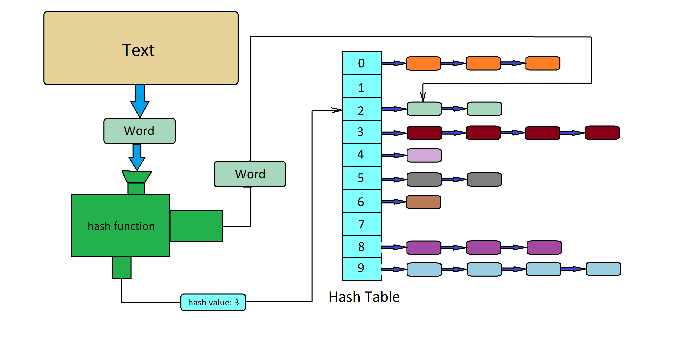

# "Hash Table"
## Project description
The project's main aim is to test different hash functions and to optimize the process of searching words in a hash table. For more information about hash and hash tables follow these links _______. Let's make a research, how changing hash function and different optimizations influence on running time and other characteristics of our program.
## Some theory
A hash table is a data structure that implements an associative array or dictionary. It is an abstract data type that maps keys to values. A hash table uses a hash function to compute an index, also called a hash code, into an array of buckets or slots, from which the desired value can be found. 

The picture below can help you to study how a hash table should be arranged:


For more information about hash tables follow https://en.wikipedia.org/wiki/Hash_table.

## Work plan
Let's create a hash table that contains single linked lists. As you can see, C++ has been chosen as the main language for realization of our plans.
Our program should have an oportunity to use different hash functions, so it's advisable to get such function as an argument.
Then we should fill the table with a great amount of words. I've chosen "Fahrengeit 451" by Ray Bradburry as a text to get words from.

##### Part 1. Testing hash functions
Let's create diagrams that show list sizes for each hash value. Ideal hash function should have a flat diagram, so we are going to compare the results and make a kind of rating of hash functions.

##### Part 2
This part of the project involves creating different manual optimizations. Here is the list of optimizations we are going to use:
1. Assembly insertions. We are going to write a function in NASM and call it from C++. Documentation for NASM can be found here https://www.opennet.ru/docs/RUS/nasm/.
2. AVX (Advanced Vector Extensions, extension of Intel & AMD command system). To learn more about AVX follow https://www.laruence.com/sse/.
3. _______Bla Bla Bla_______

A block of code to optimize will be chosen using FlameGraph - an instrument that allows to find the most slow and "heavy" functions in our program.
As a result, let's compare running time of our program before and after inseting optimizations.

## Part 1. Testing hash functions

#### Implemented features

Let's collect some statistics. It's advisable to create a function for saving all list sizes to file "table_stats.csv". Then, using LibreOffice or MS Excel, we should create diagrams with info from this file.

So, let's describe and analyze each function.

#### Hash function #1. "Always 1" [Always the first]
It's a basic hash function that always returns _1_ regardless of the word. Here is its implementation:
```
size_t Hash_Always1(const char* word)
{
    return 1;
}
```
Diagram:


As you can see, all the words have been stored to a list with index _[1]_. This function has a diagram that is as far as possible from a flat one.
Actually, __"Always 1"__ is a simple test for the algorythm, but not a function for real use.

#### Hash function #2. "First ASCII"
This hash function returns ASCII code of the first letter of a word. Here is its implementation:
```
size_t Hash_FirstASCII(const char* word)
{
    return word[0];
}
```
Diagram:


The diagram actually reminds some kind of _normal_ _distribution_. All the words have a hash value not bigger than 128. This range (from 0 to 128) is increadibly small for a good hash function. Though the diagram is far from a flat one, __"First ASCII"__ is already a possible variant for creating a working hash table.
Actually,  is a simple test for the algorythm, but not a function for real use.


## Автоматическая сборка
Чтобы запустить программу, необходимо использовать Makefile, прилагающийся к проекту. Для этого после клонирования этого репозитория на ваш компьютер  необходимо в теминале из папки репозитория набрать "make". В самом Makefile в переменной CFLAGS необходимо указать нужный тип оптимизации (см. ниже). Используя флаг условной компиляции -DDRAW  (см. Makefile) можно включать и выключать отрисовку множества, а с помощью флага -DMEASURING можно входить и выходить из режима измерений.

## Сборка вручную
Для компиляции программы необходимо прописать в терминале следующую команду:

```g++ -mavx2 -c -O3 -DDRAW mandelbrot.cpp -o mandelbrot.o```

Сборка проекта:

```g++ mandelbrot.o -o sfml-app -lsfml-graphics -lsfml-window -lsfml-system```

Чтобы запустить программу, пропишите в терминале:

```./sfml-app```

## Как достичь максимальной скорости вычислений? 

Проведем измерения FPS (количество кадров в секунду, что соответствует количеству рассчетов целого множества в секунду). Для повышения точности измерений будем усреднять значение FPS за первые 200 рассчетов множества. После 200-ой итерации в консоль выводится надпись "end of measuring". Значит, можно закрывать окно и считывать усредненное значение FPS, которое так же будет выведено в консоль сразу после закрытия окна.
Число 200 выбрано экспериментально по соотношению "время тестирования-точность результата". При желании в коде можно изменять число измерений (константа NUM_MEASURES).
В процессе измерений важно не двигать мышкой, не нажимать кнопки клавиатуры и не нагружать процессор другими способами. Эти сторонние факторы могут исказить результаты измерений.
Для упрощения измерений запустим функции с рассчета с AVX и без AVX последовательно друг за другом, вычисляя FPS отдельно для каждой функции.

### С отрисовкой


| Флаг оптимизации |       AVX2, fps        |    Без AVX2, fps    | Ускорение, раз |
| :------:         | :---------------: | :------------: | :------------: |
|    none          |       13.3        |       4.4      |       3.0      |
|    -O3           |       35.4        |       8.4      |       4.2      |
|   -Ofast         |       37.2        |       8.6      |       4.3      |

В графе "Ускорение" указано, во сколько раз использование AVX ускорило расчет по сравнению с одиночными вычислениями $\textit{при неизменном флаге компиляторной оптимизации}$.

Как мы видим, ускорение вычислений оставляет желать лучшего. Значительную часть времени работы программы составляет время, которое библиотека SFML тратит на отрисовку множества. Программно уберем отрисовку (сделаем пустое окно) и посмотрим, какого ускорения мы сможем достичь в этом случае. 

### Без отрисовки
Проведем замеры FPS для разных оптимизаций при отключенной отрисовке. 
| Флаг оптимизации |       AVX2, fps        |    Без AVX2, fps    | Ускорение, раз |
| :------:         | :---------------: | :------------: | :------------: |
|       none       |       15.6        |       4.6      |       3.4      |
|       -O1        |       57.9        |       8.9      |       6.5      |
|       -O2        |       60.0        |       9.0      |       6.7      |
|       -O3        |       58.6        |       9.1      |       6.4      |
|       -Ofast     |       64.2        |       9.4      |       6.8      |

В графе "Ускорение" указано, во сколько раз использование AVX ускорило расчет по сравнению с одиночными вычислениями $\textit{при неизменном флаге компиляторной оптимизации}$.

Отключение отрисовки существенно сказалось на времени работы программы. При малых FPS влияние отрисовки мало: 4.4 fps превратилось в 4.6 fps, ускорение в 1.05 раза. При высоких скоростях вычислений отрисовка занимает около 42% времени, что позволяет увеличить fps с 37.2 до 64.2 при её отключении.

## Сравнение результатов и выводы
Итого, мы получили, что использование AVX2 позволяет сократить время работы программы в 3-7 раз (в зависимости от типа компиляторной оптимизации). Таким образом, AVX2 в некоторых случаях может "обогнать" по времени компиляторные оптимизации, примененные к стандартному алгоритму. Одним из примеров объемных вычислений, для которых AVX-команды наиболее эффективны, и является множество Мандельброта, которое было исследовано в данном проекте.

Также необходимо отметить, что результаты измерений fps сильно зависят от многих факторов: от типа и модели процессора, от его загруженности и даже температуры. Результаты, представленные в работе, соответствуют запуску программы на процессоре Intel Core i5 при использовании Linux Mint 21. Все результаты получены при соблюдении практически одинаковых внешних условий. Однако, например, при других условиях запуска при максимальном использовании оптимизаций удается получить до 82 fps. Результаты измерений могут количественно отличаться в зависимости от условий запуска программы, но все качественные зависимости и тенденции, отмеченные в работе, сохранятся.