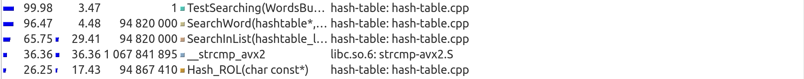

# "Hash Table" <!-- omit from toc -->

## Project description
The project's main aim is to test different hash functions and to optimize the process of searching words in a hash table. Let's make a research, how changing hash function and different optimizations influence on performance of our program.

This project is a part of MIPT course "Basics of industrial programming" by [I.R. Dedinsky](https://github.com/ded32).

## Table of contents

- [Project description](#project-description)
- [Table of contents](#table-of-contents)
- [Some theory](#some-theory)
- [Work plan](#work-plan)
      - [Part 1. Testing hash functions](#part-1-testing-hash-functions)
      - [Part 2. Optimizations](#part-2-optimizations)
- [Auto build](#auto-build)
- [Part 1. Testing hash functions](#part-1-testing-hash-functions-1)
    - [Program features](#program-features)
    - [Hash function #1. "Always 1" (Always the first)](#hash-function-1-always-1-always-the-first)
    - [Hash function #2. "First ASCII"](#hash-function-2-first-ascii)
    - [Hash function #3. "Strlen"](#hash-function-3-strlen)
    - [Hash function #4. "Sum ASCII codes"](#hash-function-4-sum-ascii-codes)
    - [Hash function #5. "ROL"](#hash-function-5-rol)
    - [Hash function #6. "ROR"](#hash-function-6-ror)
    - [Hash function #7. "RS"](#hash-function-7-rs)
    - [Results](#results)
- [Part 2. Optimizations](#part-2-optimizations-1)
  - [Description](#description)
  - [Version 0. No optimizations (_baseline_)](#version-0-no-optimizations-baseline)
  - [Version 1. AVX-paralleling of strcmp](#version-1-avx-paralleling-of-strcmp)
  - [Version 2. Assembly insertion of ROL](#version-2-assembly-insertion-of-rol)
  - [Version 3. Assembly optimization of Hash ROL](#version-3-assembly-optimization-of-hash-rol)
  - [Version 4. Changing hash function to faster one](#version-4-changing-hash-function-to-faster-one)
  - [Version 5. Increasing hash table size](#version-5-increasing-hash-table-size)
  - [General analysis](#general-analysis)
- [Conclusion](#conclusion)

## Some theory
A hash table is a data structure that implements an associative array or dictionary. It is an abstract data type that maps keys to values. A hash table uses a hash function to compute an index, also called a hash code, into an array of buckets or slots, from which the desired value can be found. 

In this project hash table contains lists of words, but there can be other ways to arrange this data structure.
The picture below can help you to study how a hash table should be arranged:


For more information about hash tables follow https://en.wikipedia.org/wiki/Hash_table.

## Work plan
Let's create a hash table that contains single linked lists. As you can see, C++ has been chosen as the main language for realization of our plans.
Our program should have an oportunity to use different hash functions, so it's advisable to get such function as an argument.
Then we should fill the table with a great amount of words. I've chosen "Fahrenheit 451" by Ray Bradbury as a text to get words from. I've chosen the original (English) text, you can find it in the folder __text__ in this project.

##### Part 1. Testing hash functions
Let's create diagrams that show list sizes for each hash value. Ideal hash function should have a flat diagram, so we are going to compare the results and make a kind of rating of hash functions.

##### Part 2. Optimizations
This part of the project involves creating different manual optimizations. Here is the list of optimizations we are going to use:
1. Assembly insertions. We are going to inline some functions using GNU Assembler. Here is a [guide](http://asmcourse.cs.msu.ru/wp-content/uploads/2013/04/gcc-inline-asm.pdf) for assembly insertions in C++.
2. Calling assembly functions from C++. Documentation for NASM can be found [here](https://www.opennet.ru/docs/RUS/nasm/).
3. AVX (Advanced Vector Extensions, extension of Intel & AMD command system). To learn more about AVX follow [Intel Intrinsics Mirror](https://www.laruence.com/sse/).
4. Choosing a better hash function that has a hardware support and is faster than others.

A block of code to optimize is chosen using tools from valgrind package. More details can be found [here](#tools-for-analysis).
As a result, let's compare running time of our program before and after inserting optimizations.

## Auto build
In order to run the program you should use Makefile. After cloning this repository to your computer type "make" in the terminal _in repo's directory_. Here is the description of Makefile's variables and flags:
- __-DLOGGING__ (flag): you can turn on and off logging by adding this flag to the __CFLAGS__ variable or deleting it. 
- __OPTFLAG__ (variable): you can choose compiler optimization (-O0, -O1, -O2, -O3 or -Ofast) and manual optimization (see [Part 2](#part-2-optimizations-1)) by adding flags to this variable.
- __-DOPT_CMP__ (flag): turns on and off AVX-paralleling of _strcmp_ ([version 1](#version-1-avx-paralleling-of-strcmp))
- __-DOPT_ROL__ (flag): turns on and off asm insertion of Rol ([version 2](#version-2-assembly-insertion-of-rol))
- __-DOPT_HASHROL__ (flag): turns on and off assembly implementation of _Hash ROL_ function ([version 3](#version-3-assembly-optimization-of-hash-rol))
- __-DOPT_CRC32__ (flag): turns on and off calling _crc32_ from asm ([version 4](#version-4-changing-hash-function-to-faster-one))

## Part 1. Testing hash functions

#### Program features

Let's collect some statistics. It's advisable to create a function for saving all list sizes to csv files with appropriate names. Then, using LibreOffice or MS Excel, we should create diagrams with info from this file.

Some words about size of the hash table. In real conditions hash tables have 1-2 elements in each list to get a better performance. These conditions cause a huge size of the hash table. But in case of testing hash functions 1-2 elements in each list spoil our diagrams and make them uninformative. That's why we should intensionally decrease hash table's size to make diagrams better.

Also, theory of hashing says, that size of a hash table should be a prime number to get a better distribution. It's obvious that this size depends on amount of words in the text. Let's choose a value for hash table size.
These conditions should be satisfied:
1. Size of the hash table should be a prime number;
2. For a rather good hash function there should be 5-20 words in each list.
   
I've taken $hashtable size = 479$ for this text. There are nearly $11,5$ words in each cell of hash table, so it's an acceptable value for our research.

So, let's start describing and analyzing each hash function.

#### Hash function #1. "Always 1" (Always the first)
It's a basic hash function that always returns _1_ regardless of the word. 

<details>
<summary><b>"Always 1" hash implementation</b></summary>

~~~C++
size_t Hash_Always1(const char* word)
{
    return 1;
}
~~~
</details>

Diagram:


As you can see, all the words have been stored to a list with index _[1]_. This function has a diagram that is as far as possible from a flat one.
Actually, __"Always 1"__ is a simple test for the algorythm of hashing, but not a function for real use.

#### Hash function #2. "First ASCII"
This hash function returns ASCII code of the first letter of a word. 

<details>
<summary><b>"First ASCII" hash implementation</b></summary>

~~~C++
size_t Hash_FirstASCII(const char* word)
{
    return word[0];
}
~~~
</details>


Diagram:


The diagram has 2 very high columns (414 words for hash value _99_ and 672 words for hash value _115_) and a small range of hash values (from 67 to 122).
Hash tables based on __"First ASCII"__ function are usable, but extremely inefficent.

#### Hash function #3. "Strlen"
This hash function returns length of a word as a hash value. Here is its implementation:

<details>
<summary><b>"Strlen" hash implementation</b></summary>

~~~C++
size_t Hash_Strlen(const char* word)
{
    return strlen(word);
}
~~~
</details>


Diagram:


The diagram actually reminds some kind of a _normal_ _distribution_. All the words have a hash value not bigger than 16. This range (from 0 to 16) is increadibly small for a good hash function. Though the diagram is far from a flat one, __"Strlen"__ is already a possible variant for creating a working hash table.

#### Hash function #4. "Sum ASCII codes"
This hash function returns sum of ASCII codes of all symbols in a word. Here is its implementation:
<details>
<summary><b>"Sum ASCII codes" hash implementation</b></summary>

~~~C++
size_t Hash_SumASCII(const char* word)
{
    size_t sum = 0;
    int i = 0;
    while (word[i] != '\0')
    {
        sum += word[i];
        i++;
    }
    return sum;
}
~~~
</details>

Diagram:
 

The first advantage of this function, that we see in the diagram - it uses all hash value range (unlike other 3 hash functions that we have already tested). I must admit, that it's because of our intensional decreasing of hash value range. In real conditions this hash function hardly uses full hash value range. Sum of ASCII codes is limited by multiplication of max ASCII code of a letter to max number of letters in a word. Hash value range can be much bigger than the result of this multiplication.
However, the diagram has 4 pronounced peaks, and some lists have up to 29 elements. __"Sum ASCII codes"__ function looks rather attractive in comparison with __"Always 1"__, __"First ASCII"__ and __"Strlen"__, but it still has a lot of disadvantages.

#### Hash function #5. "ROL"
This hash function counts the hash value using this formula:
$$H_{i+1} = rol(H_i) \wedge word[i]$$
As a start hash value we take $H_0 = 0$.
$rol$ is an assembly function that implements bit rotation to the left.
It works like this:

<details>
<summary><b>"ROL" hash implementation</b></summary>

~~~C++
size_t Hash_ROL(const char* word)
{
    size_t value = 0;
    int i = 0;
    while (word[i] != '\0')
    {
        value = (Rol(value, 1)) ^ word[i];
        i++;
    }
    return value;
}

size_t Rol(size_t value, int shift)
{
    return (value << shift) | (value >> (sizeof (int) - shift));
}
~~~
</details>

Diagram:


This function uses all hash value range too. Though the diagram has very high columns, most of them are outstanding. Generally, the values are closer to the average one, than in functions described before.

#### Hash function #6. "ROR"
This hash function is similar to the previous one, but $rol$ changes to $ror$:
$$H_{i+1} = ror(H_i) \wedge word[i]$$
As a start hash value we take $H_0 = 0$.
$ror$ is an assembly function that implements bit rotation to the right.
It works like this:
<details>
<summary><b>"ROR" hash implementation</b></summary>

~~~C++
size_t Hash_ROR(const char* word)
{
    size_t value = 0;
    int i = 0;
    while (word[i] != '\0')
    {
        value = ((value >> 1) | (value << (sizeof (int) - 1))) ^ word[i];
        i++;
    }
    return value;
}
~~~
</details>

Diagram:


This function uses all hash value range too. Though the diagram has very high columns, most of them are outstanding. Generally, the values are closer to the average one, than in functions described before.

#### Hash function #7. "RS"
I've chosen this hash function, because it has rather good characteristics and a very simple implementation. 
<details>
<summary><b>"RS" hash implementation</b></summary>

~~~C++
size_t Hash_Rs(const char* word)
{

    static const unsigned int b = 378551;
    unsigned int a = 63689;
    size_t value = 0;

    int i = 0;
    while (word[i] != '\0')
    {
        value = value * a + (unsigned char) word[i];
        a *= b;
        i++;
    }

    return value;
}
~~~
</details>

Diagram:


This function uses all hash value range too. Though the diagram has very high columns, most of them are outstanding. Generally, the values are closer to the average one, than in functions described before.

#### Results

## Part 2. Optimizations

### Description

#### Tools for analysis <!-- omit from toc -->
There is a great amount of various tools and applications that can analyze your program at runtime. I've chosen callgrind profiler (an utility that is provided in a valgrind package) for my research. It emulates each executable program instruction. Callgrind uses internal metrics about the «cost» of each instruction to give us the conclusion we need.
To install valgrind (that contains callgrind), type:

```sudo apt install valgrind```

We also need a tool that can help us to read and analyze callgrind's reports. Kcachegrind is maybe one of the most useful programs for this case.
For more information about valgrind see its [official site](https://valgrind.org/), [quick start guide](https://valgrind.org/docs/manual/quick-start.html) and [user manual](https://valgrind.org/docs/manual/manual.html).

#### Word search implemetation <!-- omit from toc -->
Probably the most important function in a hash table is a function that searches words. In my program it's rather simply implemented:

<details>
<summary><b>SearchWord implementation</b></summary>

~~~C++
int SearchWord(htab_t* hashtable, const char* word)
{
    size_t index = hashtable->HashFunc(word) % hashtable->size;

    int res = SearchInList(&(hashtable->table[index]), word);
    return res;
}
~~~
</details>

A few words about searching in a list. In real hash tables lists don't usually contain more than 1-2 words, so such search doesn't take much time. That's why the most common idea is to organize a linear search. It can be done by "sign by sign comparison" of each word from the list with the search word. 

But in our test case there can be more than 40 words in a list. It really depends on the hash function that we are going to use. So linear search can be rather slow in our conditions and maybe we should optimize it.

Here is the implementation of searching a word in a list:

<details>
<summary><b>SearchList implementation</b></summary>

~~~C++
int SearchInList(list_t* list, const char* word)
{
    node_t* node = list->head;

    for (size_t list_i = 0; list_i < list->size; list_i++)
    {
        if (!strcmp(node->elem, word))
        {
            // Word found!
            return list_i;
        }
        node = node->next;
    }

    // Word not found    
    return -1;
}
~~~
</details>

#### Choice of hash function <!-- omit from toc -->

According to the diagrams and statistics from part 1, we can see that the best 3 hash functions are: Hash RS, Hash ROL and Hash ROR. 
Hash RS is rather slow and hard to optimize. 
Hash ROL has rather good diagram and there are plenty of ways to make it faster. That's why I've chosen __Hash ROL__ for my future tests.

Now it's time to refine the program.

### Version 0. No optimizations (_baseline_)
#### Make search great again <!-- omit from toc -->
Filling hash table with the words from the text is rather slow, but it's usually done only once, right after creating a hash table. It's far more important to optimize the function that searches words, because it might be called many times.
So, let's call it for nearly 2000 times (for all words in the text in each time) to increase the influence of search functions on the program's performance.

There are 47410 words in "Fahrenheit 451" (text that is loaded into the hash table), so we are going to call __SearchWord__ function nearly $n = 47410 \cdot 2000 = 94 \text{ } 820 \text{ } 000$ times.


#### General analysis of profiling data <!-- omit from toc -->

Let's have a look at a callgrind report.


It's easy to see, that except __main__ and __TestSearching__ (general controling functions that can't be optimized) the most "heavy" functions are: __SearchWord__, __SearchInList__, __strcmp__ and __Hash ROL__. 
__SearchWord__ controls the whole search and doesn't really "eat" computer resources itself. It is shown in the second column, where we can see the time, which was spent in each function, excluding its children. 3.94 (SearchWord) is relatively small in comparison with 38.64 (strcmp). 
__SearchInList__ consists of almost one for-cycle and is too simple to be optimized.

Next function in callgrind's list is __strcmp__. It seems to be not efficent enough. Let's try to make it faster.

### Version 1. AVX-paralleling of strcmp
##### Idea <!-- omit from toc -->
Compiler usually uses __strcmp_avx2__ for standard function strcmp from \<string.h\>. The main idea is to align all words (make their addresses divisible by 32 bytes). It gives us a chance to use ordered AVX2 instructions that are faster than unordered ones.

##### Implementation <!-- omit from toc -->

To align all words we should create an alligned buffer, which size is $num\_words \cdot 32$ bytes. Here is the function of filling such buffer:

<details>
<summary><b>Filling aligned buffer function</b></summary>

~~~C++
void FillAVXWordsBuf(avx_wordsbuf_t* avx_wordsbuf, wordsbuf_t* words_buf)
{
    __m256i* temp_ptr = (__m256i*) aligned_alloc(32, words_buf->size * sizeof(__m256i));
    Assert(temp_ptr == nullptr);


    avx_wordsbuf->buf = temp_ptr;
    __m256i* avx_wb_pointer = avx_wordsbuf->buf;                                                 // points the first free elem of buffer

    for (size_t i = 0; i < words_buf->size; i++)
    {
        strcpy((char*) avx_wb_pointer, words_buf->buf[i]);        
        avx_wb_pointer++;
    }

    log("finish filling avx buf\n");

    avx_wordsbuf->buf      = temp_ptr;
    avx_wordsbuf->size     = words_buf->size;
    avx_wordsbuf->capacity = words_buf->capacity;

}
~~~
  
</details>


<br>
In structure of each list node we have to add a pointer to the word in aligned buffer:

<details>
<summary><b>New structure of node</b></summary>

~~~C++
typedef struct node
{
    const char*  elem;
    struct node* next;
    __m256i* avx_elem;

} node_t;
~~~
</details>

<br>
Now it's time to write a comparing function:

<details>
<summary><b>My implementation of avx2 strcmp</b></summary>

~~~C++
int avx_strcmp(__m256i* word1, __m256i* word2)
{
    __m256i cmp_mask = _mm256_cmpeq_epi8(*word1, *word2);

    if (_mm256_movemask_epi8(cmp_mask) == -1)    
    {
        return 0;
    }

    return -1;
}
~~~
  
</details>

##### Performance <!-- omit from toc -->
You can see the effect of this optimization:

| Optimization | Elapsed time (ms per measure)  | Absolute speed up (from baseline) |
| :----------: | :---------------: | :------------------: |
| Baseline [v.0] |      7.23        |     1                |
| AVX strcmp [v.1]|      6.05          |   1.20               |

_One measure_ means searching all words from the text. Each word is searched 1 time. There are usually 2000 _measures_.

Obviously, this optimization has a good influence on program's performance.

New callgrind report:


The next functions to optimize in callgrind's list are __Hash ROL__ and __Rol__. Let's try to refine them.

### Version 2. Assembly insertion of ROL
##### Idea <!-- omit from toc -->
In C++ there is no special function for rotating numbers, so ROL is implemented using 2 bit shifts:

<details>
<summary><b>Rol C++ implementation</b></summary>

~~~C++
size_t Rol(size_t value, int shift)
{
    return (value << shift) | (value >> (sizeof (int) - shift));
}
~~~
</details>

Luckily, __rol__ function is implemented in assembly and has a hardware support. Let's make an assembly insertion.

##### Implementation <!-- omit from toc -->

Assembly insertions in C++ are written on GNU Assembler. MSU has prepared a very useful [guide](http://asmcourse.cs.msu.ru/wp-content/uploads/2013/04/gcc-inline-asm.pdf) about writing assembly insertions.
<details>
<summary><b>My Rol assembly insertion</b></summary>

~~~C++
asm (
        ".intel_syntax noprefix\n\t"
        "mov rax, %1\n\t"
        "rol rax, 1\n\t"
        "mov %0, rax\n\t"
        ".att_syntax prefix\n\t" 
        : "=r" (rol_value)
        : "r" (value)
        : "%rax"
    );
~~~
  
</details>

##### Performance <!-- omit from toc -->

You can see the effect of this optimization:

| Optimization | Elapsed time (mcs per measure)  | Absolute speed up |
| :----------: | :---------------: | :------------------: |
| Baseline [v.0] |      7.23        |     1                |
| asm ins. rol [v.1]|      6.45         |   1.12               |

_One measure_ means searching all words from the text. Each word is searched 1 time. There are usually 2000 _measures_.

New callgrind report looks like that:


As we can see, inlining __rol__ made our hash function faster. In baseline self time in 2nd column ($13.14_\text{Hash ROL} + 10.33_\text{Rol} = 23.47$) was bigger than with asm insertion ($17.43$).
Therefore, we can conclude that this optimization made our program faster. However, __Hash ROL__ has even more oportunities to be optimized.

### Version 3. Assembly optimization of Hash ROL
##### Idea <!-- omit from toc -->
Let's go further and rewrite whole __Hash ROL__ function in assembly and call it from C++.

##### Implementation <!-- omit from toc -->

The function is written on __NASM 64__.
<details>
<summary><b>Hash ROL assembly implementation</b></summary>

~~~nasm
section .text
global asm_HashROL

asm_HashROL:
    push rcx 
    push rdx

    xor     eax, eax                ; start hash value = 0
    xor     ecx, ecx                ; symbol counter
.loop:
    mov     dl, byte [rdi + rcx]    ; dl = current symbol

    cmp     dl, 0                   ; reached end of line?
    je      .finish_hashing         ; if reached, finish hashing
    
    rol     eax, 1                  ; rotate left (shift = 1), 11001101 -> 10011011
    xor     al, dl                  ; xor last hash byte with current symbol

    inc     ecx                     ; increase counter
    jmp     .loop                   ; continue

.finish_hashing:
    pop rdx 
    pop rcx
    ret
~~~
  
</details>

##### Performance <!-- omit from toc -->
You can see the effect of this optimization:

| Optimization | Elapsed time (ms per measure)  | Absolute speed up (from baseline) |  Relative speed up (from prev. version) |
| :----------: | :---------------: | :------------------: |  :------------------: |
| Baseline [v.0] |      7.23        |     1                |     1                |
| asm ins. rol [v.1] |      6.45        |     1.12                |     1.12                |
| asm rolhash [v.2]|      6.01          |   1.20               |     1.07                |

_One measure_ means searching all words from the text for 1 time. Each word is searched 1 time. There are usually 2000 _measures_.

New callgrind report:


As we can see, rewriting the whole hash function in assembly appeared to be even faster than asm insertion. So, it's better to use optimization from [v.3] than from [v.2] (they are incompatible).

The next function to optimize (except __strcmp__ that is used in filling hash table) is __FillHTable__. This function is not related to searching words, so we don't have an aim to optimize such functions in this work. Instead of it, let's try to change hash function.

### Version 4. Changing hash function to faster one
##### Idea <!-- omit from toc -->

Instead of optimizing __Hash ROL__, we can change it to __CRC32__. It's a hardware supported hash function, so it may make hashing faster.

##### Implementation <!-- omit from toc -->

Let's write this function on __NASM 64__ and call from C++.
<details>
<summary><b>CRC32 assembly implementation</b></summary>

~~~nasm
section .text

global asm_crc32

asm_crc32:
    xor     rax, rax
    crc32   rax, qword [rdi]
    crc32   rax, qword [rdi+8]
    crc32   rax, qword [rdi+16]
    crc32   rax, qword [rdi+24]
    ret
~~~
  
</details>

##### Performance <!-- omit from toc -->
You can see the effect of this optimization:

| Optimization     | Elapsed time (ms per measure)  | Absolute speed up (from baseline) |  Relative speed up (from prev. version) |
| :--------------: | :---------------: | :------------------: |  :--------------------: |
| Baseline [v.0]   |      7.23         |     1                |        1                |
| asm rolhash [v.3]|      6.01         |     1.20             |     1.20                |
| asm crc32 [v.4]  |      5.19         |     1.39             |     1.16                |

_One measure_ means searching all words from the text for 1 time. Each word is searched 1 time. There are usually 2000 _measures_.

As we can see, crc32, as a hardware supported function, appeared to be even faster than assembly __Hash ROL__. Therefore, in cases when we don't have to use complex and safe hash functions, hardware supported ones are preferable because of their speed. 

### Version 5. Increasing hash table size
##### Idea <!-- omit from toc -->

At the start of this research we intensionally decreased hash table's size. It was reasonable for testing search of words. Now let's try to approach to real conditions of hash table's work. We are going to measure, how increasing hash table's size influences the program's performance.

##### Implementation <!-- omit from toc -->

In average we should have one word in each cell of our hash table. So, let's сhoose a value of hash table size to satisfy this condition. Experimatally, $hashtable \text{ } size = 3583$, which is a prime number. There are $1.53$ words in each cell in average.

##### Performance <!-- omit from toc -->
You can see the effect of this optimization:

| Optimization     | Elapsed time (ms per measure)  | Absolute speed up (from baseline) |
| :--------------: | :---------------: | :------------------: |
| Baseline [v.0]   |      7.23         |     1                |
| inc. size [v.5]  |      3.76        |          1.92       |

_One measure_ means searching all words from the text for 1 time. Each word is searched 1 time. There are usually 2000 _measures_.

We can admire a fantastic performance: the speed up is really great. 


### General analysis
Now we've made a lot of optimizations - it's time to combine them and choose the most successful ones. In description of each version we measured speed up from baseline (all previous optimizations were switched off). Now it's time for making combinations.
As the majority of our optimizations are independent, so the success of current optimization causes using it in all next versions. All details can be seen in the table below:

| Optimizations     | Elapsed time (ms per measure)  | Absolute speed up (from baseline) |  Relative speed up (from prev. version) |
| :-------------------------------------------: | :-----------------: | :----------------: |  :------------------: |
| Baseline [v.0]                                |      7.23           |     1              |        1              |
| avx strcmp [v.1]                              |      6.05           |     1.20             |        1.20             |
| strcmp + rol [v.1 + v.2]                      |      5.57           |     1.30             |     1.09                |
| strcmp + rolhash [v.1 + v.3]                  |      5.09           |     1.42             |     1.09                |
| strcmp + crc32 [v.1 + v.4]                    |      3.78           |     1.91             |     1.35                |

Increasing hash table size is a serious change of conditions that outruns all code optimizations. That's why it should be considered as a new baseline.

| Optimizations     | Elapsed time (ms per measure)  | Absolute speed up (from baseline) |  Relative speed up (from prev. version) |
| :-------------------------------------------: | :---------------: | :----------------: |  :------------------: |
| inc. size (new baseline) [v.5]                |      3.76           |          1       |     1                |
| avx strcmp [v.1]                              |      3.51           |          1.07    |        1.07             |
| inc. size + strcmp + rolhash [v.1 + v.3 + v.5]|      2.67           |          1.40    |     1.31                |
| inc. size + strcmp + crc32 [v.1 + v.4 + v.5]  |      1.44           |          2.61    |     1.85                |

Let's analyze these tables.

#### Table 1. Small hash table size <!-- omit from toc -->

My AVX strcmp outran library one because of aligning words. Increase of performance is sufficient (20%).
Inlining rol made the program 10% faster, but rewriting the whole __Hash ROL__ function was even more efficent (10% speed up from inlining rol).
However, CRC32 outran all my attempts to write __Hash ROL__ function in assembly. Maybe it's because of __CRC32__'s hardware support.

#### Table 2. Big hash table size <!-- omit from toc -->
But the most efficent optimization was to approach to real conditions. I increased the hash table's size (that was intensionally decreased at the beginning of the research).
However, in this new conditions optimizations appeared to be even more efficent.

On the one hand, __strcmp__'s speed up is not so big as in the 1st table (7% instead of 20%). Every list in hash table became shorter. Instead of comparing with nearly 11 words in a list we started to compare with 1-2 words. The importance of strcmp dropped, so it's influence on performance is rather small.

On the other hand, optimization of hash function became even more important, so the speed up of __CRC32__ rose up to nearly 2 times. 

## Conclusion
All in all, I tested different hash functions and optimized the process of search in a hash table.

Among the hash functions I tested __Hash_RS__ has the best diagram. However, there is a plenty of different hash functions that have different parameters, so choice of hash function can be a whole science. But in this project you can see a method that allows us to compare other hash functions.

My optimizations of strcmp and hash functions made the program faster (the speed up is bigger than 2.5 times). So we can consider this work to be successful.

I think this work may be useful not only for me, but for other people who work with hash tables.